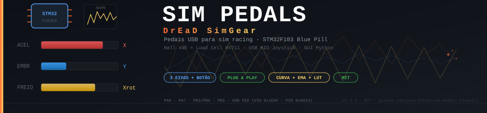

# 🏁 SIM Pedals — BluePill

<div align="center">

[](../../actions/workflows/build.yml)
[](../../releases)
[](LICENSE)
[](CHANGELOG.md)
[](docs/HARDWARE.md)
[](https://www.arduino.cc/)
[](gui/)
[](../../pulls)

**Pedaleira USB HID para *Sim Racing* baseada em STM32 BluePill com célula de carga via HX711, sensores Hall, calibração assistida, curva de resposta configurável e GUI dedicada. Ideal para projetos DIY.** 🏎️💨

[📦 Releases](../../releases) · [📖 Documentação](#-documentação) · [🐛 Issues](../../issues) · [💬 Discussões](../../discussions)

</div>

---



---

## Índice

- [Visão Geral](#-visão-geral)
- [Recursos](#-recursos)
- [Hardware](#-hardware)
- [Início Rápido](#-início-rápido)
- [Compilar e Gravar o Firmware](#️-compilar-e-gravar-o-firmware)
  - [Método 1 — Release Pronta](#método-1--release-pronta-mais-fácil-)
  - [Método 2 — arduino-cli](#método-2--arduino-cli-recomendado-para-devs)
  - [Método 3 — Arduino IDE 2.x](#método-3--arduino-ide-2x)
- [Calibração do Freio](#️-calibração-do-freio)
- [Comandos Seriais](#️-comandos-seriais)
- [Ajuste Fino](#️-ajuste-fino)
- [CI/CD — Automação](#-cicd--automação)
- [Documentação](#-documentação)
- [Estrutura do Projeto](#-estrutura-do-projeto)
- [Contribuindo](#-contribuindo)
- [Licença](#-licença)

---

## 🎯 Visão Geral

🏎️💨 SIM Pedals é um projeto DIY open-source para construir uma **pedaleira de Sim Racing USB HID** com componentes acessíveis e desempenho de alto nível.

O freio usa uma **célula de carga** (load cell) com amplificador HX711 — a mesma tecnologia usada em pedaleiras comerciais de alto custo — enquanto acelerador e embreagem utilizam **sensores Hall 49E** sem contato mecânico, garantindo durabilidade e linearidade. Tudo é configurado via uma **GUI Python** com osciloscópio em tempo real, editor de curvas arrastrável e gerenciamento de perfis.

### Pipeline de processamento do freio

```
HX711 raw → (raw − bMin) / (bMax − bMin) → bscale → curva (gamma/LUT) → EMA → deadzone → USB HID
```

---

## ✨ Recursos

### Firmware (STM32 / Arduino)

| Recurso | Detalhes |
|---------|----------|
| **3 eixos USB HID** | Acelerador (X), Embreagem (Y), Freio (Xrotate) — escala 0–1023 |
| **Botão físico** | Entrada PB5 com debounce de 15 ms, habilitável/inversível |
| **Calibração robusta** | `bzero`/`bfull` por **mediana de 9 leituras** (imune a picos de ruído) |
| **Proteção de range** | `bMax ≥ bMin + 20.000 counts` evita o efeito "freio no talo" |
| **`bscale`** | Escala e sentido do freio ajustáveis de −10 a +10 |
| **Curva gamma** | Resposta progressiva configurável (`ga`), padrão 1.6 |
| **LUT de 32 pontos** | Curva totalmente personalizada com interpolação linear |
| **Filtro EMA** | Suavização ajustável por eixo, alpha = ema/1000 |
| **Deadzone** | Zona morta reescalada (sem "pulo" no primeiro valor acima do dz) |
| **EEPROM** | Persistência completa de configuração entre sessões |
| **Diagnóstico** | Comando `diag` mede ruído pico-a-pico do HX711 |
| **Telemetria serial** | 50 Hz via USB CDC (DATA,rawAx,rawAy,rawB,hx,hy,hb,btn) |

### GUI (Python)

| Recurso | Detalhes |
|---------|----------|
| **Monitor ao vivo** | Barras HID em tempo real para os 3 eixos e botão |
| **Auto-calibração** | Captura axMin/axMax/ayMin/ayMax movendo os pedais |
| **Osciloscópio** | Gráfico temporal dos 3 eixos para diagnóstico de ruído |
| **Editor de curva** | 32 pontos arrastáveis com presets (Linear, Progressiva, S-curve) |
| **Controle de bscale** | Slider, spinbox e presets para ajuste rápido de sensibilidade |
| **Perfis JSON** | Salvar/carregar configuração completa (incluindo calibração) |
| **Thread separada** | Envio de LUT e comandos sem travar a UI, debounce 150 ms |
| **Auto-detecção** | Porta COM marcada com ★ na lista |

---

## 🔌 Hardware

### Pinagem

| Função | Pino | Tipo |
|--------|------|------|
| Acelerador | **PA6** | INPUT_ANALOG (ADC1_IN6) |
| Embreagem | **PA7** | INPUT_ANALOG (ADC1_IN7) |
| HX711 DOUT | **PB4** | INPUT |
| HX711 SCK | **PB3** | OUTPUT |
| Botão HID | **PB5** | INPUT_PULLUP |

### BOM (Lista de Materiais)

| Componente | Qtd | Observação |
|------------|-----|------------|
| STM32F103C8T6 (Blue Pill) | 1 | Clone funciona; verifique 64 KB ou 128 KB de flash |
| Sensor Hall 49E (analógico) | 2 | Acelerador + Embreagem — alimentar em **3.3V** |
| Célula de carga | 1 | 100 kg recomendado |
| Módulo HX711 | 1 | Alimentar em 5V para melhor SNR |
| Switch momentâneo | 1 | Botão HID (opcional) |
| Ímãs de neodímio 6–10 mm | 2 | Para os sensores Hall |
| Fios Dupont / jumpers | — | Para prototipagem |

> Consulte [`docs/HARDWARE.md`](docs/HARDWARE.md) para o diagrama de ligação completo e pinagem detalhada.

### Identidade USB

| Campo | Valor |
|-------|-------|
| VID | `0x1EAF` |
| PID | `0x0024` |
| Fabricante | DrEaD SimGear |
| Produto | SIM Pedals |

---

## 🚀 Início Rápido

### Pré-requisitos comuns

- Python 3.8+ com `pip`
- Driver STM32 Virtual COM Port — [download](https://www.st.com/en/development-tools/stsw-stm32102.html) (Windows) ou `linux-modules-extra` (Linux)
- [`dfu-util`](https://dfu-util.sourceforge.net/) para gravar o firmware

### 1. Clonar e preparar

```bash
git clone https://github.com/Jean-DrEaD/sim-pedals-bluepill.git
cd sim-pedals-bluepill
cp include/config.h.example include/config.h   # personalizações opcionais de pinos/VID/PID
```

> `include/config.h` está no `.gitignore` — nunca será commitado acidentalmente.

---

## 🛠️ Compilar e Gravar o Firmware

Escolha **um** dos três métodos abaixo. Todos produzem o mesmo `.bin`.

---

### Método 1 — Release Pronta (mais fácil) ⭐

> Não requer Arduino IDE nem arduino-cli. Ideal para quem só quer usar a pedaleira.

1. Acesse a página de [**Releases**](../../releases)
2. Baixe `sim_pedals_vX.Y.Z.bin` da release mais recente
3. Coloque a Blue Pill em modo DFU: ponha **BOOT0 = HIGH** (jumper em 1) e conecte o USB
4. Grave com `dfu-util`:

**Windows (PowerShell):**
```powershell
.\dfu-util.exe -d 1eaf:0003 -a 2 -D sim_pedals_v1.0.0.bin -R
```

**Linux / macOS:**
```bash
dfu-util -d 1eaf:0003 -a 2 -D sim_pedals_v1.0.0.bin -R
```

5. O parâmetro `-R` reinicia a placa automaticamente. Retorne **BOOT0 = LOW** (jumper em 0).

---

### Método 2 — arduino-cli (recomendado para devs)

> Compila e grava na linha de comando, sem GUI. Mesmo toolchain usado pelo CI.

#### 2.1 Instalar o arduino-cli

```bash
# Linux / macOS
curl -fsSL \
  "https://github.com/arduino/arduino-cli/releases/download/v1.1.1/arduino-cli_1.1.1_Linux_64bit.tar.gz" \
  | tar -xz -C /usr/local/bin arduino-cli

arduino-cli version   # deve exibir 1.1.1
```

**Windows:** baixe o `.zip` em [arduino.github.io/arduino-cli](https://arduino.github.io/arduino-cli/latest/installation/) e adicione ao PATH.

#### 2.2 Instalar o core STM32 (Roger Clark) via git clone

> ⚠️ O Roger Clark **não distribui mais** o core via Board Manager (`package_STM32duino_index.json` retorna 404).
> A instalação correta é via `git clone` direto na pasta `hardware/` do Arduino.

```bash
# Localiza a pasta de sketchbook do Arduino (normalmente ~/Arduino no Linux/macOS
# ou %USERPROFILE%\Documents\Arduino no Windows)
SKETCHBOOK="$HOME/Arduino"   # ajuste se necessário

mkdir -p "$SKETCHBOOK/hardware"
git clone --depth 1 \
  https://github.com/rogerclarkmelbourne/Arduino_STM32.git \
  "$SKETCHBOOK/hardware/Arduino_STM32"
```

**Windows (PowerShell):**
```powershell
$sketchbook = "$HOME\Documents\Arduino"
New-Item -ItemType Directory -Force "$sketchbook\hardware" | Out-Null
git clone --depth 1 `
  https://github.com/rogerclarkmelbourne/Arduino_STM32.git `
  "$sketchbook\hardware\Arduino_STM32"
```

Após o clone, **reinicie o arduino-cli** (ou o Arduino IDE) para que o core seja reconhecido.

#### 2.3 Instalar o toolchain ARM

O Roger Clark core exige `arm-none-eabi-gcc`:

```bash
# Linux (Debian/Ubuntu)
sudo apt-get install gcc-arm-none-eabi binutils-arm-none-eabi

# macOS (Homebrew)
brew install --cask gcc-arm-embedded

# Windows: baixe e instale o GNU Arm Embedded Toolchain em
# https://developer.arm.com/downloads/-/gnu-rm
```

#### 2.4 Instalar as bibliotecas

```bash
arduino-cli lib install "USBComposite for STM32F1"
arduino-cli lib install "HX711 Arduino Library"

# Verificação
arduino-cli lib list | grep -i "USBComposite"
arduino-cli lib list | grep -i "HX711"
```

#### 2.5 Compilar

```bash
# FQBN: Arduino_STM32 = nome da pasta clonada em hardware/
#        STM32F1       = subpasta de arquitetura dentro do repo
#        genericSTM32F103C = board ID no boards.txt
arduino-cli compile \
  --fqbn Arduino_STM32:STM32F1:genericSTM32F103C \
  --build-path ./build \
  ./src/sim_pedals
```

O binário gerado é `build/sim_pedals.ino.bin`.

#### 2.6 Gravar via DFU

Com a Blue Pill em modo DFU (BOOT0 = HIGH, USB conectado):

**Linux / macOS:**
```bash
dfu-util -d 1eaf:0003 -a 2 -D build/sim_pedals.ino.bin -R
```

**Windows (PowerShell):**
```powershell
.\dfu-util.exe -d 1eaf:0003 -a 2 -D build\sim_pedals.ino.bin -R
```

> Após a gravação, retorne BOOT0 = LOW e reconecte o USB. A placa aparecerá como `SIM Pedals`.

---

### Método 3 — Arduino IDE 2.x

#### 3.1 Instalar o core STM32 (Roger Clark) via git clone

> ⚠️ O Board Manager URL do Roger Clark não funciona mais (404). Instale o core manualmente:

**Linux / macOS:**
```bash
git clone --depth 1 \
  https://github.com/rogerclarkmelbourne/Arduino_STM32.git \
  ~/Arduino/hardware/Arduino_STM32
```

**Windows (PowerShell):**
```powershell
git clone --depth 1 `
  https://github.com/rogerclarkmelbourne/Arduino_STM32.git `
  "$HOME\Documents\Arduino\hardware\Arduino_STM32"
```

Reinicie o Arduino IDE após o clone. O core aparecerá automaticamente no menu de placas.

#### 3.2 Instalar as bibliotecas

**Ferramentas → Gerenciar bibliotecas** — instale:

| Biblioteca | Autor |
|------------|-------|
| `USBComposite for STM32F1` | arpruss |
| `HX711 Arduino Library` | bogde |

#### 3.3 Configurar a placa

Em **Ferramentas**, defina exatamente:

| Opção | Valor |
|-------|-------|
| Placa | `Generic STM32F103C series` (sob **Arduino STM32**) |
| Variant | `STM32F103C8 (20k RAM, 64k Flash)` |
| Upload method | `STM32duino bootloader` (Maple DFU) |
| CPU Speed | `72 MHz (Normal)` |

#### 3.4 Compilar e exportar o binário

1. Abra `src/sim_pedals/sim_pedals.ino`
2. Vá em **Sketch → Exportar Binário Compilado** (`Ctrl+Alt+S`)
3. O `.bin` será gerado em `src/sim_pedals/build/Arduino_STM32.STM32F1.genericSTM32F103C/`

#### 3.5 Gravar via DFU

Com a Blue Pill em modo DFU (BOOT0 = HIGH, USB conectado):

**Windows (PowerShell):**
```powershell
.\dfu-util.exe -d 1eaf:0003 -a 2 `
  -D "src\sim_pedals\build\Arduino_STM32.STM32F1.genericSTM32F103C\sim_pedals.ino.bin" -R
```

**Linux / macOS:**
```bash
dfu-util -d 1eaf:0003 -a 2 \
  -D "src/sim_pedals/build/Arduino_STM32.STM32F1.genericSTM32F103C/sim_pedals.ino.bin" -R
```

---

### Modo DFU — Referência Rápida

| Jumper | Posição | Quando usar |
|--------|---------|-------------|
| BOOT0 = HIGH | Jumper em `1` | Antes de conectar o USB para gravar |
| BOOT0 = LOW | Jumper em `0` | Uso normal — após gravar, reconecte |

> **Dica:** alguns clones requerem pressionar RESET após colocar BOOT0 = HIGH com o USB já conectado, em vez de reconectar.

---

### 4. Iniciar a GUI

```bash
pip install pyserial
python gui/pedals_gui.py
```

1. Clique em **↻** para atualizar as portas — a Blue Pill aparece com ★
2. Selecione a porta e clique **Conectar**
3. Clique **Monitor OFF → Monitor ON** para iniciar a telemetria

> Para um guia mais detalhado, veja [`docs/QUICKSTART.md`](docs/QUICKSTART.md).

---

## 🎛️ Calibração do Freio

> Esta é a etapa mais importante. Sem calibração, qualquer pressão ativa o freio no máximo.

| Passo | Ação |
|-------|------|
| 1 | Conecte e ligue **Monitor ON** |
| 2 | **Solte** completamente o pedal → clique **⊘ Tara/Zero (bMin)** |
| 3 | **Pise com força máxima** → clique **⛂ Pisar fundo (bMax)** |
| 4 | Verifique: a barra Xrot deve ir de 0% a ~100% |
| 5 | Ajuste `bscale` (0.6–0.8 para sensibilidade reduzida) |
| 6 | Clique **Salvar EEPROM** |

**Freio vai na direção errada?** Marque **invb** nas inversões de eixo.

**Freio satura muito cedo?** Repita o passo 3 pisando com mais força — o firmware garante `bMax ≥ bMin + 20.000 counts`.

> Guia completo: [`docs/CALIBRATION.md`](docs/CALIBRATION.md)

---

## ⚙️ Comandos Seriais

A placa aceita comandos via Serial (integrados na GUI ou via qualquer terminal serial a 115200 baud):

| Comando | Descrição |
|---------|-----------|
| `?` | Exibe configuração atual (`CFG,...`) |
| `bzero` | Grava repouso do freio (tara / bMin) pela mediana de 9 leituras |
| `bfull` | Grava força máxima do freio (bMax) com proteção de range mínimo |
| `bscale <v>` | Escala e sentido do freio (−10 a 10; valores típicos: 0.6–1.0) |
| `ga <v>` | Curvatura gamma do freio (padrão: 1.6) |
| `usecurve <0\|1>` | Alterna entre gamma (0) e LUT personalizada (1) |
| `ema <v>` | Fator EMA — menor = mais suavização (padrão: 60) |
| `dz <v>` | Deadzone em unidades HID (padrão: 8) |
| `invx / invy / invb` | Inverte eixo acelerador / embreagem / freio |
| `btnen <0\|1>` | Habilita/desabilita botão físico |
| `invbtn <0\|1>` | Inverte lógica do botão |
| `diag` | Mede ruído pico-a-pico (P2P) do HX711 (~30 amostras) |
| `l` | Liga/desliga telemetria (Monitor ON/OFF) |
| `save` | Persiste configuração na EEPROM |
| `load` | Carrega configuração da EEPROM |
| `def` | Restaura padrões de fábrica |
| `getcurve` | Retorna os 32 pontos da LUT atual |

---

## 🎚️ Ajuste Fino

### Parâmetros principais

| Parâmetro | Faixa | Padrão | Efeito |
|-----------|-------|--------|--------|
| `ga` | 0.2 – 5.0 | **1.6** | Curvatura do freio — maior = mais força necessária |
| `ema` | 1 – 1000 | **60** | Suavização — menor = mais suave/lento (mais filtragem) |
| `dz` | 0 – 200 | **8** | Zona morta — aumentar se o pedal oscilar em repouso |
| `bscale` | −10 – 10 | **1.0** | Escala do freio — 0.6–0.8 para load cells rígidas |

### Perfis sugeridos para Sim Racing

| Estilo | `ga` | `ema` | `dz` | Notas |
|--------|------|-------|------|-------|
| GT / Endurance | 1.6 | 60 | 8 | Padrão — modulação progressiva |
| F1 / Open Wheel | 2.0 | 100 | 5 | Freio difícil, resposta rápida |
| Rally | 1.2 | 40 | 12 | Linear, suaviza vibrações |
| Drift | 0.8 | 100 | 5 | Muito sensível no início |

> Guia completo: [`docs/TUNING.md`](docs/TUNING.md)

---

## 📚 Documentação

| Documento | Conteúdo |
|-----------|----------|
| [`docs/QUICKSTART.md`](docs/QUICKSTART.md) | Do zero aos pedais funcionando em 10 minutos |
| [`docs/HARDWARE.md`](docs/HARDWARE.md) | Pinagem, BOM, diagrama de ligação, sensores Hall 49E |
| [`docs/CALIBRATION.md`](docs/CALIBRATION.md) | Calibração detalhada do freio, acelerador e embreagem |
| [`docs/TUNING.md`](docs/TUNING.md) | EMA, gamma, LUT, deadzone, diagnóstico de ruído |
| [`CHANGELOG.md`](CHANGELOG.md) | Histórico de versões |

---

## 📁 Estrutura do Projeto

```
sim-pedals-bluepill/
├── src/sim_pedals/         # Firmware principal (.ino)
├── gui/                    # Interface gráfica Python
│   ├── pedals_gui.py
│   └── requirements.txt
├── include/
│   └── config.h.example    # Template de configuração
├── docs/
│   ├── images/             # banner.svg, wiring.svg
│   ├── HARDWARE.md
│   ├── QUICKSTART.md
│   ├── CALIBRATION.md
│   └── TUNING.md
├── ci/                     # GitHub Actions (build, libraries)
├── CHANGELOG.md
└── README.md
```

---

## 🤖 CI/CD — Automação

O projeto usa dois workflows GitHub Actions, ativados automaticamente.

### `build.yml` — Build contínua

Dispara em todo push para `main`, `develop`, `fix/*` e `feat/*`, e em pull requests para `main`.

```
push / PR → Checkout → Instala arduino-cli 1.1.1 → Clona Arduino_STM32 (Roger Clark) via git
          → Instala arm-none-eabi-gcc → Instala bibliotecas (ci/libraries.txt)
          → Compila (FQBN: Arduino_STM32:STM32F1:genericSTM32F103C) → Faz upload do .bin
```

O artefato gerado (`sim_pedals_<branch>.bin`) fica disponível em **Actions → seu workflow → Artifacts**.

### `release.yml` — Publicação de release

Dispara automaticamente ao criar uma tag semântica (`vX.Y.Z`):

```
git tag v1.0.0 && git push origin v1.0.0
```

O workflow executa a mesma build, extrai as notas da versão correspondente do `CHANGELOG.md` e publica automaticamente na página de Releases com dois anexos:

| Arquivo | Conteúdo |
|---------|----------|
| `sim_pedals_vX.Y.Z.bin` | Firmware compilado, pronto para gravar via DFU |
| `pedals_gui_vX.Y.Z.zip` | GUI Python (`pedals_gui.py` + `requirements.txt` + docs) |

> As notas de release são extraídas automaticamente da seção `[X.Y.Z]` do `CHANGELOG.md`. Mantenha o changelog atualizado antes de criar a tag.

---

## 🤝 Contribuindo

Contribuições são bem-vindas! Abra uma [issue](../../issues) para bugs ou sugestões, ou envie um [pull request](../../pulls).

### Configurar o hook de pre-commit (recomendado)

```bash
git config core.hooksPath .githooks
```

O hook verifica automaticamente antes de cada commit:

| Check | O que valida |
|-------|-------------|
| Arquivos sensíveis | Bloqueia `config.h`, `.env`, `.key`, `.pem` no stage |
| `FW_VERSION` | Garante que o define existe e segue SemVer (`X.Y.Z`) |
| Workflows | Executa `actionlint` nos YAMLs alterados (se instalado) |
| CHANGELOG | Avisa se não há entrada para a versão atual do firmware |

### Antes de enviar um PR

- O firmware compila sem erros com `Arduino_STM32:STM32F1:genericSTM32F103C` (veja Método 2)
- A GUI funciona com Python 3.8+ e `pyserial`
- `FW_VERSION` no `.ino` e entrada no `CHANGELOG.md` estão sincronizados
- Mudanças no protocolo serial (`CFG,...` / `DATA,...`) estão refletidas na documentação

---

## 📝 Licença

Distribuído sob a licença **MIT**. Veja [`LICENSE`](LICENSE) para detalhes.

---

<div align="center">

Feito com ❤️ para a comunidade de Sim Racing · **[Jean-DrEaD](https://github.com/Jean-DrEaD)**

</div>
